# FEA & Topology Optimization — AI-Assisted Workflow

This repository demonstrates AI-assisted finite element analysis and topology optimization using two solver stacks:

| | **Abaqus + Tosca** | **Plato Engine** |
|---|---|---|
| **License** | Commercial | Open-source (BSD) |
| **Solver** | Abaqus Standard/Explicit | Plato Analyze (GPU-capable) |
| **Optimizer** | Tosca Structure | ROL (Trilinos) |
| **Mesher** | Abaqus CAE | Gmsh |
| **Mesh format** | `.inp` (proprietary) | Exodus II `.exo` (open standard) |
| **Scripting** | Python 2.7 (Abaqus API) | `.i` input deck + XML |
| **Skills** | 16 Claude Code skills | 12 Claude Code skills |

All scripts and workflows were developed collaboratively with Claude AI using the [Claude Code](https://claude.ai/code) skills system.

---

## Plato Engine (Open-Source)

Open-source topology optimization using [Plato Engine](https://github.com/sandialabs/platoengine) from Sandia National Labs. Runs on HPC clusters via SLURM. No commercial license required.

### Cantilever Beam — Topology Optimization

- **Geometry**: 100 × 20 × 10 mm box
- **Material**: Steel (E=210 GPa, nu=0.3)
- **Objective**: Minimize compliance (maximize stiffness)
- **Constraint**: 30% volume fraction
- **Solver**: Plato Analyze + ROL optimizer, 50 iterations

| Density Field (ParaView 3D) | Density Field (matplotlib 2D) |
|---|---|
| 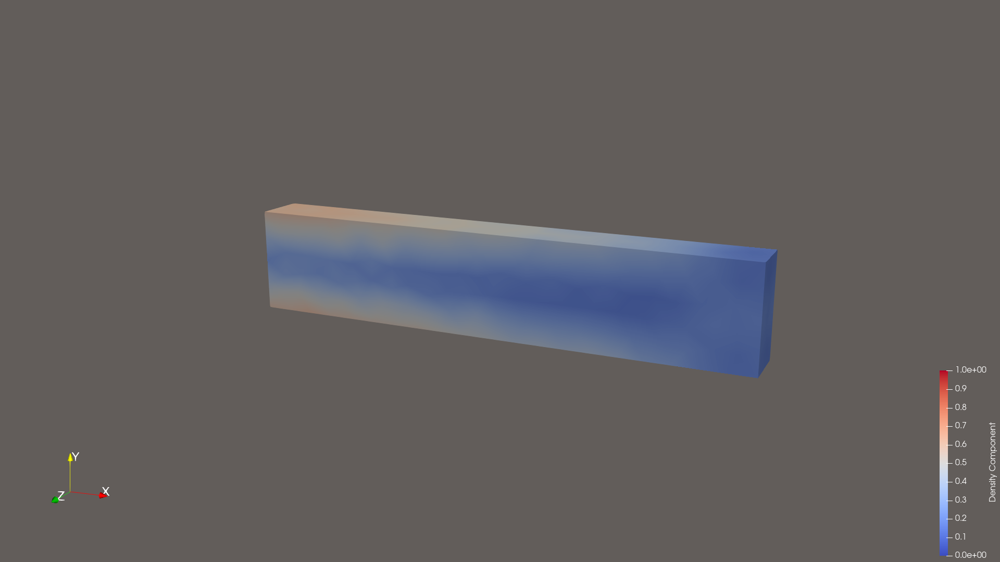 | 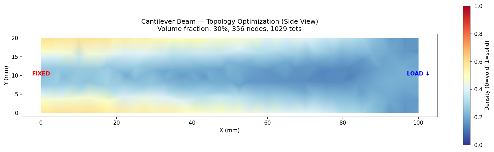 |

| Optimized Shape (density > 0.3) | Convergence |
|---|---|
| 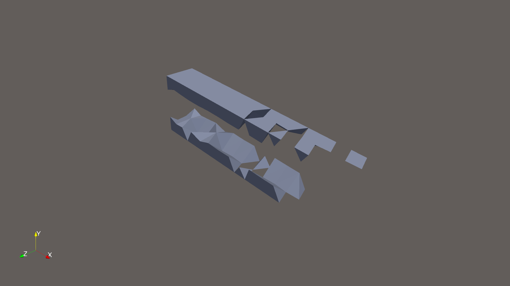 | 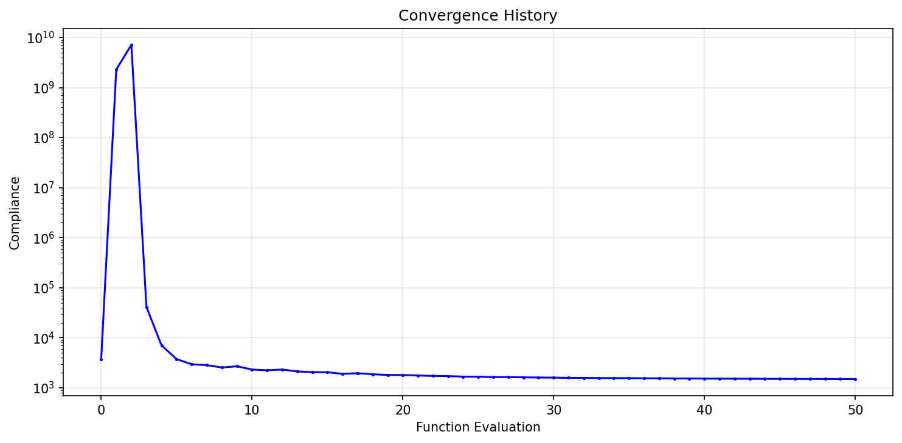 |

### IN718 Fatigue Specimen — Multi-Load-Case Topology Optimization

Reproduction of the paper's fatigue specimen using Plato instead of Abaqus+Tosca. Runs on **2 nodes** with **3 MPI ranks** (one per load case).

- **Geometry**: 146 × 65 × 25 mm envelope with 3 pin holes (Ø12.7 mm)
- **Material**: IN718 (E=200 GPa, nu=0.3)
- **Load cases**: 20 kN vertical + ±5 kN horizontal (3 objectives, parallel MPI)
- **Constraint**: 30% volume fraction
- **HPC**: 2 nodes, 3 MPI ranks, 16 OpenMP threads each

| Side View (Density) | Optimized Shape | Mid-Plane Cross Section |
|---|---|---|
| 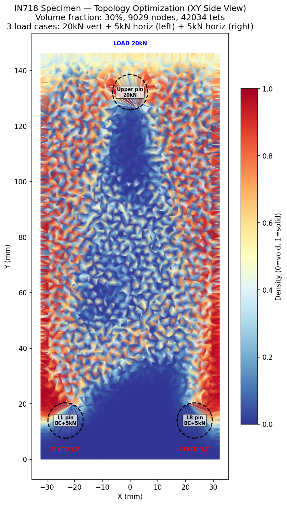 | 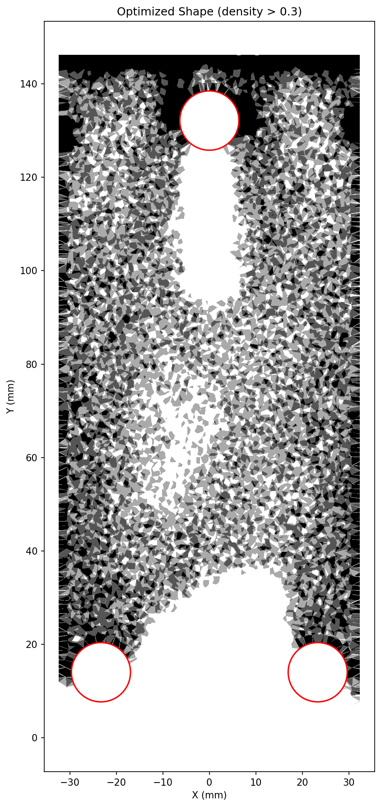 | 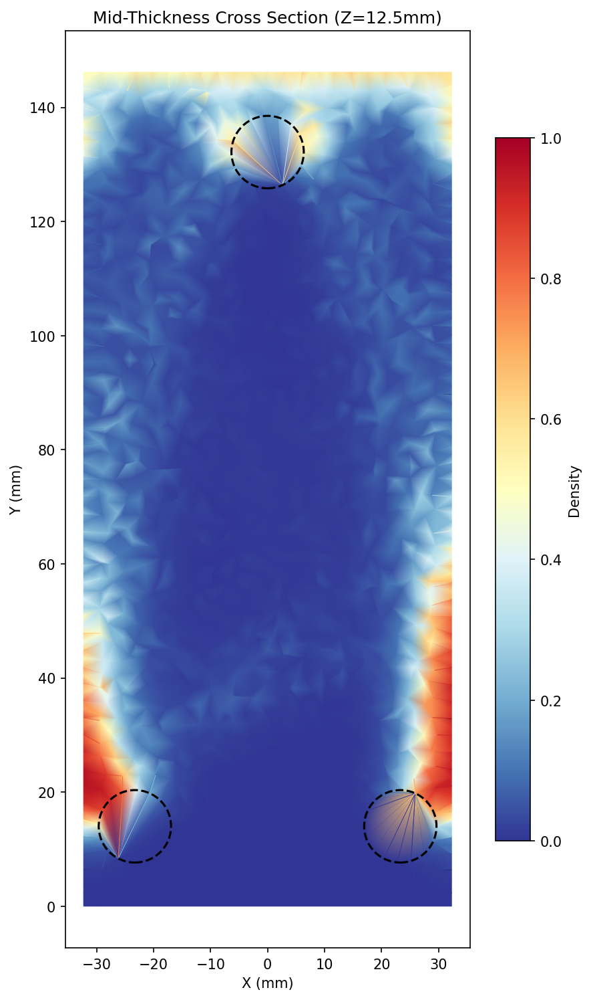 |

The topology shows load paths from the upper pin to the two lower pins — matching the expected Y-bracket pattern from the Abaqus experiments.

### Running Plato

```bash
# 1. Generate mesh (Gmsh)
python3 generate_mesh_simple.py

# 2. Run optimization (via SLURM — never on login nodes)
sbatch run_multinode.sh

# Or interactively:
srun --account=bekn-delta-cpu --partition=cpu-interactive \
  --time=00:30:00 --ntasks=1 --mem=16g --pty bash -c '
  source /projects/bekn/jcernuda/plato/spack/share/spack/setup-env.sh
  spack env activate /projects/bekn/jcernuda/plato
  spack load platoanalyze
  plato input.i
'
```

See [`plato-docs/installation-log.md`](plato-docs/installation-log.md) for building Plato on any HPC cluster.

---

## Abaqus (Commercial)

### Examples

#### Cantilever Beam
- **Geometry**: 200 × 20 × 10 mm beam
- **Load**: 1000 N point load at free end
- **Material**: Steel (E=210 GPa, nu=0.3)

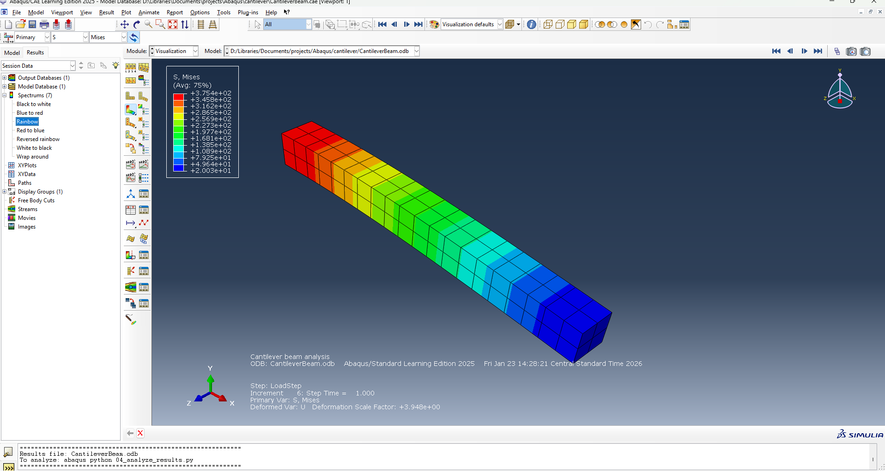

**Results**: Max stress 150.2 MPa, Max displacement 0.476 mm

#### Cube Compression
- **Geometry**: 10 × 10 × 10 mm cube
- **Load**: 1 MPa uniform pressure

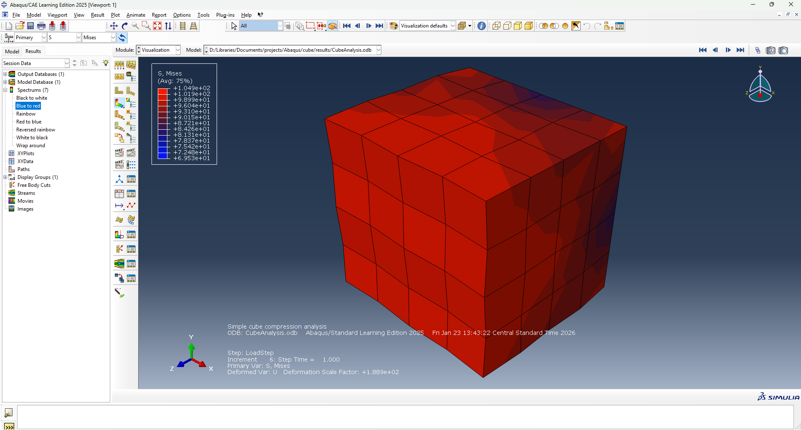

### Paper Reproduction: IN718 Fatigue Specimen

Reproduction of the fatigue specimen from the paper using Abaqus, featuring a topology-optimized geometry with three pin holes.

**Specimen**: 146 mm height, IN718 (E=200 GPa, sigma_y=980 MPa), pin holes Ø12.7 mm

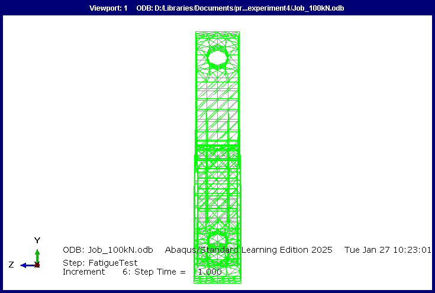

#### Static Analysis Results (Abaqus)

| Load | Max Stress | Plastic Strain (PEEQ) | Response |
|------|------------|----------------------|----------|
| 20 kN | 380 MPa | 0% | Elastic |
| 60 kN | 982 MPa | 0.1% | Yield onset |
| 100 kN | 1148 MPa | 6.7% | Plastic |

| 20 kN (Elastic) | 60 kN (Yield) | 100 kN (Plastic) |
|---|---|---|
| 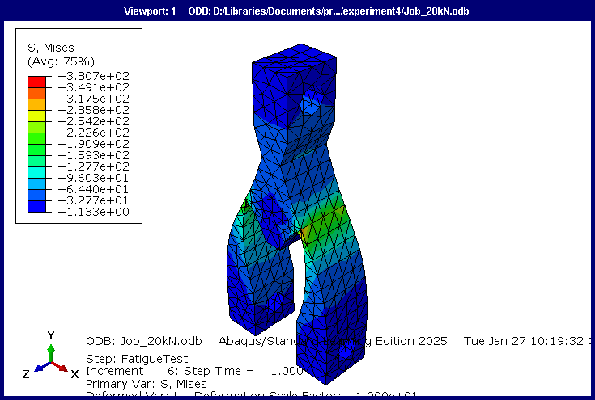 | 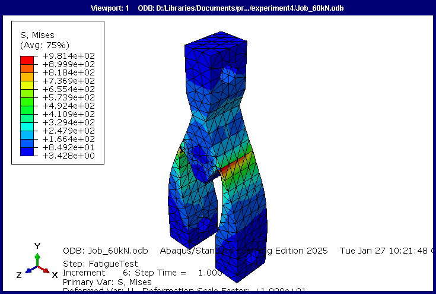 | 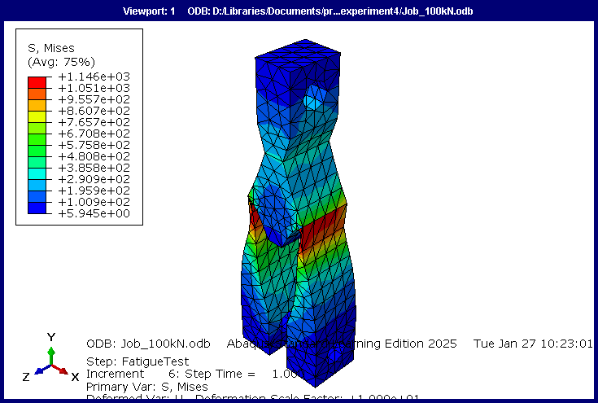 |

### Running Abaqus

```bash
# With GUI
abaqus cae script=script_name.py

# Headless
abaqus cae noGUI=script_name.py

# Post-processing only
abaqus python script_name.py
```

**Note**: Topology optimization requires a full Abaqus license with the Tosca module.

---

## Project Structure

```
.claude/skills/
  abaqus*/              # 16 Abaqus skills (geometry, mesh, BC, load, TO, etc.)
  plato*/               # 12 Plato skills (mesh, material, BC, load, TO, etc.)

examples/               # Simple FEA examples (cantilever, cube)

paper_reproduction/
  experiment4/          # IN718 static analysis (Abaqus) — final working model
  experiment10/         # Stress-constrained TO (Abaqus+Tosca)

plato-tests/
  cantilever/           # Cantilever beam TO (Plato) — smoke test
  in718_specimen/       # IN718 specimen TO (Plato) — multi-node, 3 load cases

plato-docs/             # Plato installation guide for HPC clusters
delta-reference.md      # NCSA Delta cluster quick reference
```

## Units

All models use consistent units: **mm, N, MPa, tonne/mm³**

## Claude Code Skills

This repository uses a hierarchical skills system for AI-assisted FEA:

- **Master routers** (`abaqus`, `plato`) interpret user intent and route to specialized skills
- **Workflow orchestrators** run end-to-end pipelines (static analysis, topology optimization)
- **Module skills** handle individual tasks (meshing, materials, BCs, loads, jobs, results)

Ask Claude to "optimize a cantilever beam with Plato" or "run a static analysis with Abaqus" and the skills system handles the rest.
